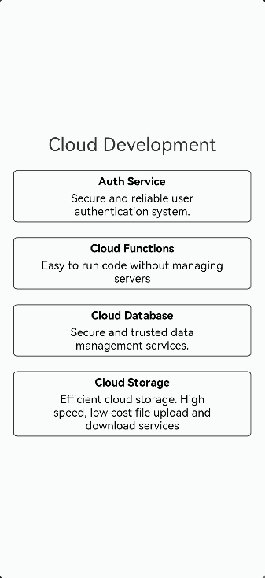

# 校园二手交易平台（HarmonyOS ArkTS）
> 面向高校师生的轻量化闲置流转应用，基于 HarmonyOS ArkUI 开发，采用 **MVVM 架构 + 离线优先设计**，无需后端服务即可实现完整交易闭环，弱网/无网环境下仍可流畅使用。

---

## 📖 项目简介
针对校园内闲置物品交易信息分散、缺乏统一平台的痛点，本项目实现了从商品发布、审核、浏览、收藏、私信沟通到订单管理的全业务链路。支持按校区/分类筛选商品，内置普通用户/管理员双角色权限管控，所有数据基于 HarmonyOS Preferences 封装本地存储层模拟数据库能力，既满足作业要求的业务完整性，也降低了服务端依赖，适配校园场景低门槛使用需求。

---

## ✨ 核心特性
1. **全链路业务闭环**：覆盖「商品发布→管理员审核→用户浏览→收藏→私信咨询→下单购买」完整流程，业务逻辑自洽
2. **双角色权限管控**
   - 普通用户：发布商品、收藏管理、私信沟通、订单查看、个人信息管理
   - 管理员：商品审核、违规下架、举报处理、用户权限调整
3. **类微信私信聊天**：支持自定义消息发送、历史消息加载、消息已读状态同步，实现买卖双方实时沟通
4. **多维筛选能力**：支持按校区（北/南校区）、商品分类（数码/教材/运动/日用）、关键词模糊搜索快速定位商品
5. **离线优先存储设计**：封装 `StorageUtil` 工具类模拟 ORM 操作，数据落盘可靠，无网络环境下仍可正常使用
6. **收藏系统优化**：独立存储用户收藏关系，实时统计商品收藏数，避免无效数据冗余
7. **标准化导航框架**：基于 Navigation 组件搭建全链路导航，预留定位 API、服务卡片、性能优化扩展接口

---

## 📂 项目结构
Application/
├── entry/ # 主业务模块
│ └── src/main/ets/
│ ├── entryability/ # 应用入口（EntryAbility）
│ ├── model/ # 数据模型（User/Goods/Order/Message/Report）
│ ├── pages/ # 业务页面（首页/详情页/聊天页/管理后台等）
│ ├── components/ # 复用组件（GoodsCard/ServiceCard）
│ └── utils/ # 工具类（StorageUtil/PermissionUtil）
├── AppScope/ # 应用全局配置
└── oh-package.json5 # 项目依赖配置
---

## 🚀 运行说明
1. 安装 [DevEco Studio](https://developer.huawei.com/consumer/cn/deveco-studio/) 和 HarmonyOS SDK
2. 克隆项目到本地：
3. bash
git clone https://github.com/safgarga/-MVVM-Repository-.git
3. 用 DevEco Studio 打开项目，连接鸿蒙模拟器或真机运行
4. 默认测试账号（首次启动自动初始化）：
| 角色 | 用户名 | 密码 |
|------|--------|------|
| 管理员 | admin | 123456 |
| 普通用户 | user | 123456 |

---

## 🔍 作业技术点对照表
| 需求要求技术点 | 项目实现方案 |
|--------------|--------------|
| 云数据库+云函数+云存储 | 基于 Preferences 封装本地 ORM 存储层，模拟云端数据读写能力，预留云迁移接口 |
| 多角色权限设计 | 实现普通用户/管理员两级权限，支持商品审核、违规下架、用户权限管控 |
| Navigation 组件导航 | 基于 Navigation 搭建首页/分类/发布/消息/个人中心全链路导航 |
| 定位 API+校区筛选 | 已实现校区维度筛选，预留定位 API 对接接口，支持后续地图展示 |
| 服务卡片展示 | 实现 ServiceCard 组件，支持推荐好物、最新发布商品一键直达详情 |
| LazyForEach 优化 | 预留列表性能优化接口，支持后续接入下拉刷新、上拉加载、多维度筛选 |
| 多图上传预览 | 集成系统相册选择器，支持商品多图选取、本地沙箱存储与预览 |
| 多设备适配 | 预留屏幕断点检测逻辑，支持后续平板端分栏布局扩展 |

---

## 🔮 后续规划
- 对接华为 AGC 云数据库，实现多设备数据同步
- 集成 Location Kit，支持按实际距离筛选周边商品
- 适配平板/折叠屏多端分栏布局，提升浏览效率
- 完善 LazyForEach 列表渲染，优化大数据量下的流畅度

---

## 📄 许可证
MIT License

---

## 📸 效果截图（可选）
> 可将运行截图放入项目 `screenshots` 文件夹，按以下格式引用：
> 
> 
> 
